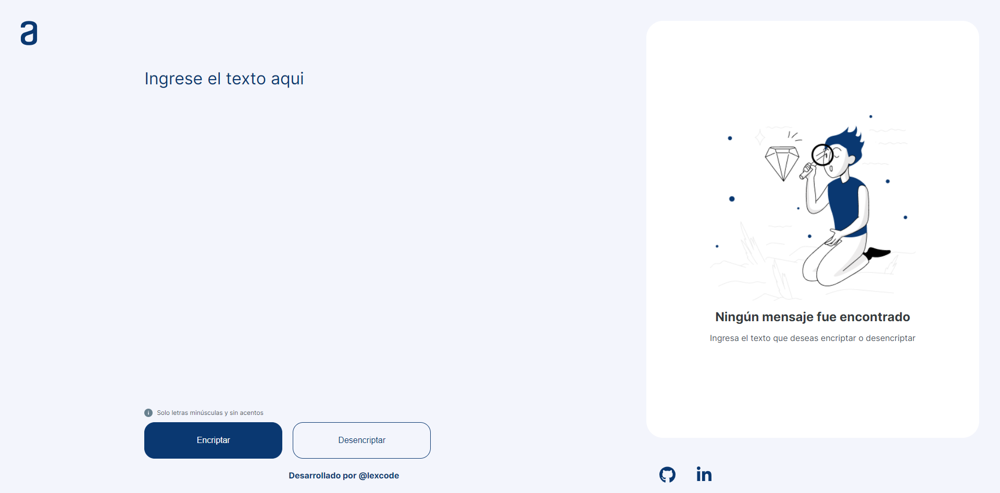

# Encriptador-de-texto
Este es mi proyecto como parte del Alura Challenge, que consiste en una herramienta que codifica y decodifica texto. Este reto me ha ayudado a mejorar mis habilidades al crear proyectos para mi portafolio. 
#challengeonecodificador4

## Tabla de contenidos

- [Vista general](#vista-general)
  - [El reto](#el-reto)
  - [Vista previa](#vista-previa)
  - [Links](#links)
- [Author](#author)

## Vista general

### El reto

Los usuarios son capaces de:

- Ver de forma responsive la app dependiendo del tamaño de sus dispositivos
- Interactuar con los botones a traves del estado hover
- Conventir texto común en texto encriptado y tener la posibilidad de desencriptarlo si asi se desea
- Copiar el texto encriptado en el portapapeles

### Vista previa

### Links

- Solution URL: [Repository](https://github.com/lexcode1227/decodificador-de-texto)
- Live Site URL: [Github-pages](https://lexcode1227.github.io/decodificador-de-texto/)

## Author

- Linkedin - [@henry-agustin](https://www.linkedin.com/in/henry-agustin-/)